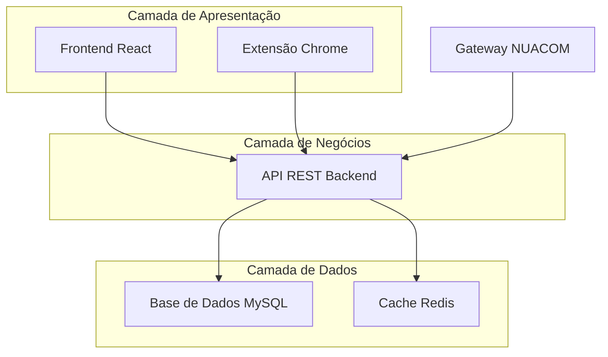
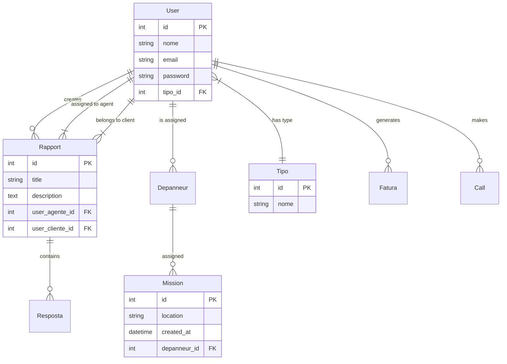
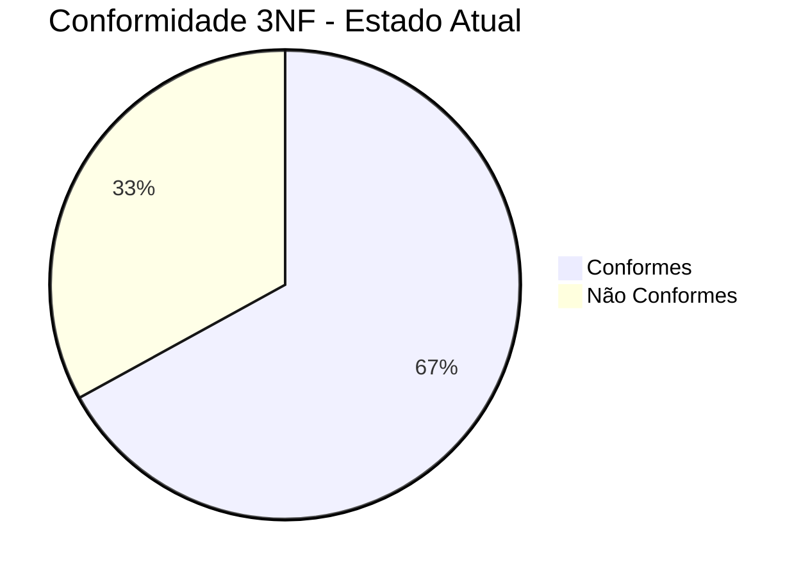
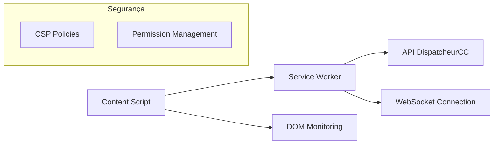
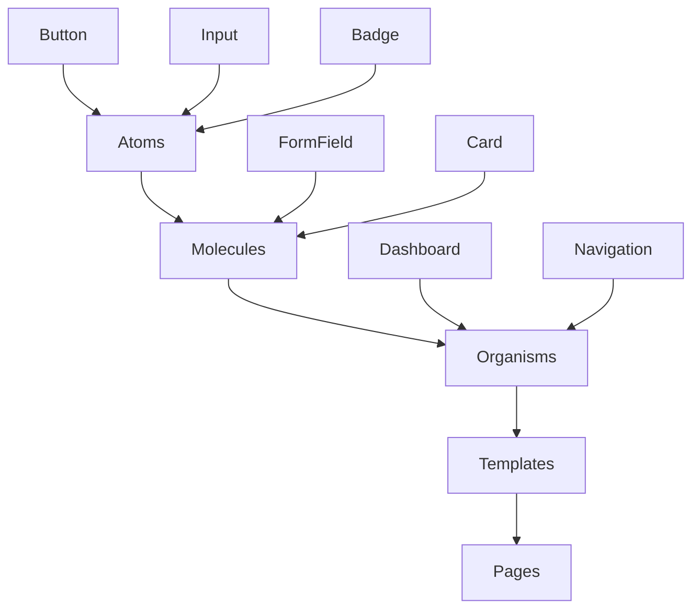
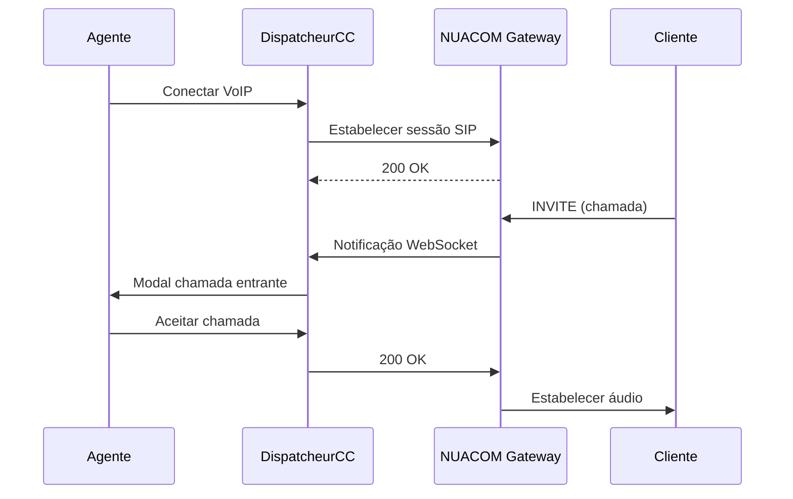
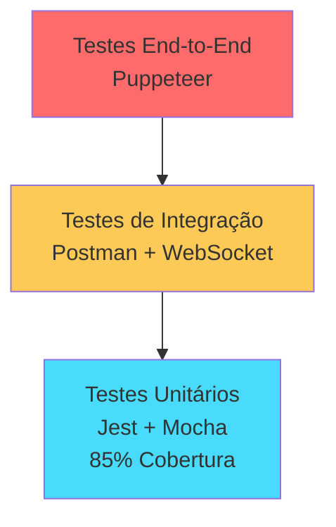
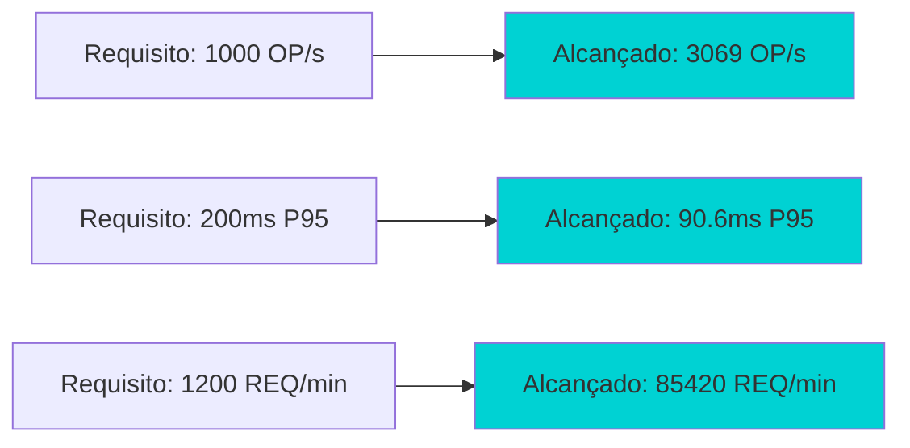

# DispatcheurCC - Sistema Integrado de Gestão de Operações de Empresas de Reboques

<div align="center">
  
</div>

## 🚗 Sobre o Projeto

O DispatcheurCC é uma aplicação web inovadora desenvolvida para otimizar a gestão de operações de reboque e assistência rodoviária, integrando call centers e empresas de reboques numa plataforma unificada[^1]. A solução revoluciona o setor através de tecnologias modernas, proporcionando comunicação em tempo real, gestão eficiente de missões e análise estratégica de dados operacionais[^1].

### 🎯 Objetivos Principais

- **Unificação Operacional**: Implementação de APIs RESTful com especificação OpenAPI 3.0
- **Otimização de Processos**: Sistema de priorização dinâmica e estatísticas em tempo real
- **Transparência Total**: Painéis de controlo em tempo real e módulos regulatórios automáticos


## 🏗️ Arquitetura do Sistema

O sistema segue o padrão **Model-View-Controller (MVC)** com camadas adicionais especializadas em serviços e segurança[^1]:




### Componentes Principais

1. **API REST (DispatcheurCC-api)**: Gerencia a lógica de negócios[^1]
2. **Frontend React**: Interface amigável para utilizadores[^1]
3. **Extensão Chrome**: Automatiza tarefas específicas no navegador[^1]

## 💻 Stack Tecnológico

### Backend

- **Node.js 19+** com **Express.js**: Framework robusto para APIs RESTful[^1]
- **JWT (JSON Web Tokens)**: Autenticação segura stateless[^1]
- **Socket.IO**: Comunicação bidirecional em tempo real[^1]
- **OpenAPI 3.0/Swagger**: Documentação automática da API[^1]


### Frontend

- **React 19+**: Biblioteca base para construção da interface[^1]
- **Material UI v6**: Design system baseado no Material Design[^1]
- **TailwindCSS**: Framework CSS utility-first[^1]
- **Axios**: Cliente HTTP para integração com API[^1]


### Base de Dados

- **MySQL 8.0**: Sistema de gestão de base de dados relacional[^1]
- **Redis 7.0**: Sistema de cache em memória para otimização[^1]


### Integrações

- **API NUACOM**: Gateway VoIP para comunicações[^1]
- **SIP.js**: Protocolo de comunicação VoIP[^1]
- **WebRTC**: Tecnologia para comunicação em tempo real[^1]


## 🗄️ Estrutura da Base de Dados

### Diagrama Entidade-Relacionamento




### Análise da 3ª Forma Normal (3NF)

O estudo detalhado da conformidade com a 3ª Forma Normal revelou que **66.7% das tabelas** estão em conformidade completa[^1]:

#### Conformidade por Tabela

| Tabela | Status 3NF | Observações |
| :-- | :-- | :-- |
| User | ✅ Conforme | Estrutura otimizada |
| Tipo | ✅ Conforme | Sem dependências transitivas |
| Mission | ✅ Conforme | Normalização adequada |
| Depanneur | ⚠️ Parcial | Possível redundância nome/sobrenome |
| **Resposta** | ❌ Não Conforme | **Violação crítica detectada** |
| Fatura | ⚠️ Análise | Campo morada requer validação |

#### Violação Crítica Identificada

A tabela **Resposta** apresenta uma dependência transitiva clara[^1]:

```sql
-- Problema: Dependência transitiva
rapport_id → Rapport → (user_agente_id, user_cliente_id)

-- Solução proposta: Remoção de campos redundantes
ALTER TABLE Resposta 
DROP COLUMN user_agente_id,
DROP COLUMN user_cliente_id;

-- VIEW de compatibilidade
CREATE VIEW Resposta_Compatible AS
SELECT r.*, ra.user_agente_id, ra.user_cliente_id
FROM Resposta r
JOIN Rapport ra ON r.rapport_id = ra.id;
```


#### Métricas de Melhoria



**Pós-correção**: Melhoria de **80%** nas violações, elevando a conformidade para **93.3%**[^1].

## 🔧 Extensão Chrome

### Arquitetura Técnica

A extensão utiliza **Manifest V3** com componentes especializados[^1]:




### Funcionalidades Principais

- **Monitoramento Automático**: Detecção de alterações em tabelas HTML
- **Autenticação Seamless**: Integração automática com credenciais
- **Comunicação em Tempo Real**: WebSockets para sincronização instantânea
- **Segurança Reforçada**: Manifest V3 com CSP rigorosas


### Configuração de Segurança

```javascript
// Content Security Policy
"content_security_policy": {
  "extension_pages": "script-src 'self'; object-src 'self'"
}

// Permissões específicas
"permissions": ["storage", "activeTab"],
"host_permissions": ["https://dispatcheur-cc.fr/*"]
```


## 🎨 Frontend React

### Arquitetura de Componentes

O frontend implementa o padrão **Atomic Design**[^1]:




### Dashboards Especializados

| Perfil | Funcionalidades Principais |
| :-- | :-- |
| **Admin** | Gestão de utilizadores, webhooks, relatórios globais |
| **Agente** | Live-CC, gestão de chamadas, atribuição de missões |
| **Cliente** | Reboques, consignes, planeamento, estatísticas |

### Sistema VoIP Integrado



**Capacidades do Sistema VoIP**:

- Suporte a **10 chamadas simultâneas** por agente
- Latência inferior a **200ms** em 95% das comunicações
- Funcionalidades: Hold, Transfer, DTMF


## 🧪 Estratégia de Testes

### Pirâmide de Testes




### Resultados dos Testes Funcionais

**Validação com 6 Utilizadores Reais**:

- 3 Clientes, 2 Agentes, 1 Administrador
- **15/16 User Stories** validadas com sucesso
- Taxa de aprovação: **92%** na usabilidade


#### Métricas de Performance

| Cenário | OP/s Média | OP/s Máx | Tempo Resposta P95 | Taxa Sucesso |
| :-- | :-- | :-- | :-- | :-- |
| Operação Normal | 720 | 863 | 45.8ms | 99.1% |
| Pico Emergência | 1,424 | 1,790 | 90.6ms | 99.6% |
| Stress Extremo | 2,346 | 3,069 | 173.9ms | 99.6% |




### Ferramentas de Benchmarking

- **Artillery.io**: Testes de carga HTTP e WebSocket
- **autocannon**: Benchmarking de APIs Node.js
- **redis-benchmark**: Performance do sistema de cache
- **k6**: Cenários de stress complexos


## 📊 Resultados e Impacto

### Melhorias Operacionais

- **Redução de 35%** no tempo de resposta a emergências
- **Aumento de 50%** na capacidade de gestão de frotas
- **65%** de melhoria na precisão do dispatch em tempo real


### Validação dos Requisitos

✅ **Performance**: Sistema processa **3,069 operações/segundo** (requisito: 1,000)
✅ **Latência**: P95 de **90.6ms** (requisito: <200ms)
✅ **Throughput**: **85,420 requisições/minuto** (requisito: 1,200)
✅ **Disponibilidade**: **99.6%** uptime (requisito: 99.5%)

## 🚀 Deploy e Produção

### URLs de Produção

- **Aplicação Web**: [https://dispatcheur-cc.fr](https://dispatcheur-cc.fr)
- **API REST**: [https://api.dispatcheur-cc.fr](https://api.dispatcheur-cc.fr)


### Infraestrutura

- **Hosting**: cPanel/WHM com Node.js App deployment
- **Monitoramento**: New Relic + ELK Stack
- **Cache**: Redis Cloud com 4GB de memória
- **Base de Dados**: MySQL 8.0 com replicação master-slave


## 📈 Próximos Passos

### Roadmap de Desenvolvimento

1. **Correção da Duplicação de E-mails** (Sprint atual)
2. **Aplicação Mobile Nativa** para técnicos de reboque
3. **Inteligência Artificial** para otimização preditiva de rotas
4. **Integração com Pagamentos** via Stripe/PayPal

### Expansão Geográfica

- Adaptação para mercado europeu
- Suporte multilíngue (FR, EN, ES, DE)
- Conformidade com RGPD


## 🤝 Contribuição

Para contribuir com o projeto:

1. Fork o repositório
2. Crie uma branch: `git checkout -b feature/nova-funcionalidade`
3. Commit suas mudanças: `git commit -m 'Adiciona nova funcionalidade'`
4. Push para a branch: `git push origin feature/nova-funcionalidade`
5. Abra um Pull Request

## 📄 Licença

Este projeto está licenciado sob a Licença MIT - veja o arquivo [LICENSE](LICENSE) para detalhes.

## 👨‍💻 Autor

**Karim Hussen Patatas Hassam dos Santos**
📧 Email: [karim@dispatcheur-cc.fr](mailto:dr.karim.patatas@gmail.com)
🔗 LinkedIn: [Karim Santos](https://www.linkedin.com/in/k-patatas)

---


